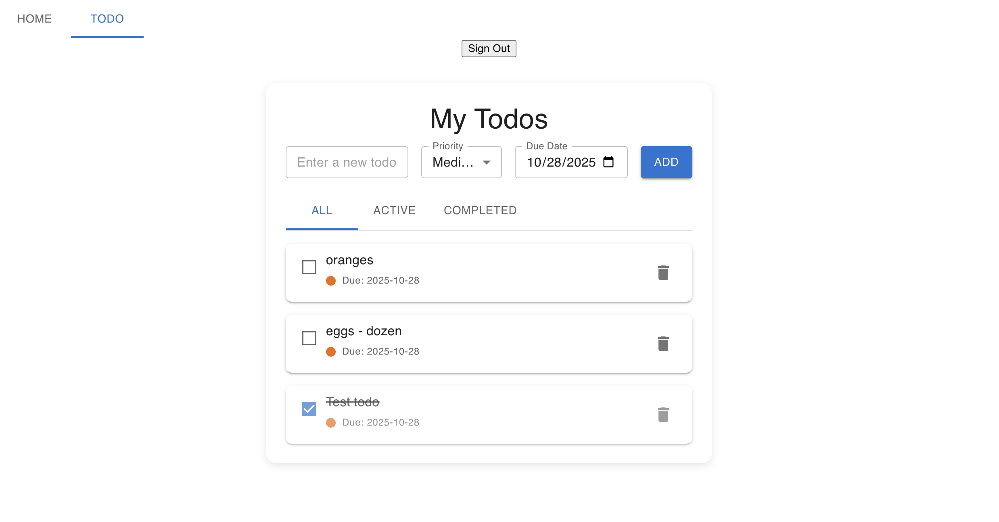

My Todos - Cloud-Based Task Manager
A full-stack todo application with user authentication, real-time cloud sync, and secure data management.
🚀 Live Demo
Live App: https://react-counter-mu-nine.vercel.app/#/todo
✨ Features

🔐 User Authentication - Secure signup/login with email and password
☁️ Cloud Sync - Todos saved to Supabase database, accessible from any device
🔒 Data Security - Row-level security ensures users only see their own todos
✅ Full CRUD Operations - Create, read, update, and delete todos
🎯 Priority Levels - Organize tasks by Low, Medium, or High priority
📅 Due Dates - Set deadlines for your tasks
🔍 Smart Filtering - View all todos, active only, or completed only
✏️ Inline Editing - Click on any todo to edit it directly
📱 Responsive Design - Works seamlessly on desktop and mobile devices

🛠️ Tech Stack
Frontend:

React 18 with TypeScript
Redux Toolkit for state management
Material-UI (MUI) for UI components
React Router for navigation
Vite for build tooling

Backend & Database:

Supabase (PostgreSQL database)
Supabase Auth for authentication
Row-Level Security (RLS) policies for data protection

Deployment:

Vercel for hosting and CI/CD

📸 Screenshots

🏃‍♂️ Running Locally
Prerequisites

Node.js 16+ installed
npm or yarn package manager

Installation

Clone the repository

bash   git clone https://github.com/smandepudi/React-Counter.git
   cd React-Counter

Install dependencies

bash   npm install

Set up Supabase

Create a free account at supabase.com
Create a new project
Get your project URL and anon key from Project Settings → API
Update src/lib/supabase.ts with your credentials

Create the database table
Run this SQL in your Supabase SQL Editor:

sql   -- Create todos table
   CREATE TABLE todos (
     id BIGSERIAL PRIMARY KEY,
     user_id UUID REFERENCES auth.users NOT NULL,
     text TEXT NOT NULL,
     completed BOOLEAN DEFAULT false,
     priority TEXT DEFAULT 'Medium',
     due_date DATE,
     created_at TIMESTAMPTZ DEFAULT NOW()
   );

   -- Enable Row Level Security
   ALTER TABLE todos ENABLE ROW LEVEL SECURITY;

   -- Create policies
   CREATE POLICY "Users can view own todos"
   ON todos FOR SELECT
   USING (auth.uid() = user_id);

   CREATE POLICY "Users can insert own todos"
   ON todos FOR INSERT
   WITH CHECK (auth.uid() = user_id);

   CREATE POLICY "Users can update own todos"
   ON todos FOR UPDATE
   USING (auth.uid() = user_id);

   CREATE POLICY "Users can delete own todos"
   ON todos FOR DELETE
   USING (auth.uid() = user_id);

Start the development server

bash   npm run dev

Open your browser
Navigate to http://localhost:5173

🔑 Environment Variables
Update src/lib/supabase.ts with your Supabase credentials:
typescriptconst supabaseUrl = 'YOUR_SUPABASE_PROJECT_URL'
const supabaseAnonKey = 'YOUR_SUPABASE_ANON_KEY'
📦 Build for Production
bashnpm run build
The optimized build will be in the dist folder.
🎯 Key Implementation Highlights
Authentication Flow

JWT-based authentication with Supabase Auth
Protected routes that redirect to login if unauthenticated
Automatic session management and refresh

State Management

Redux Toolkit with async thunks for API calls
Optimistic updates for better UX
Centralized error handling

Security

Row-Level Security (RLS) policies ensure data isolation
User_id validation on all database operations
Secure API keys managed through Supabase

Database Design

Normalized schema with proper foreign key relationships
Indexed queries for optimal performance
Timestamp tracking for audit trails

🚧 Future Enhancements

 Add subtasks/nested todos
 Implement recurring tasks
 Add collaborative lists for team sharing
 Dark mode toggle
 Export todos to CSV/PDF
 Email reminders for due dates
 Mobile app with React Native
 Drag-and-drop reordering

📝 What I Learned
This project demonstrates proficiency in:

Building full-stack applications with modern React
Implementing secure authentication flows
Working with PostgreSQL and database design
Managing complex state with Redux Toolkit
Integrating third-party APIs (Supabase)
Deploying production applications
Writing clean, maintainable TypeScript code

👤 Author
Your Name

GitHub: @yourusername
LinkedIn: Your LinkedIn
Portfolio: yourportfolio.com

📄 License
This project is open source and available under the MIT License.